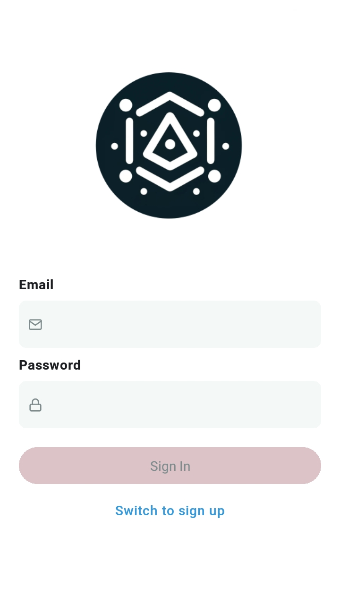
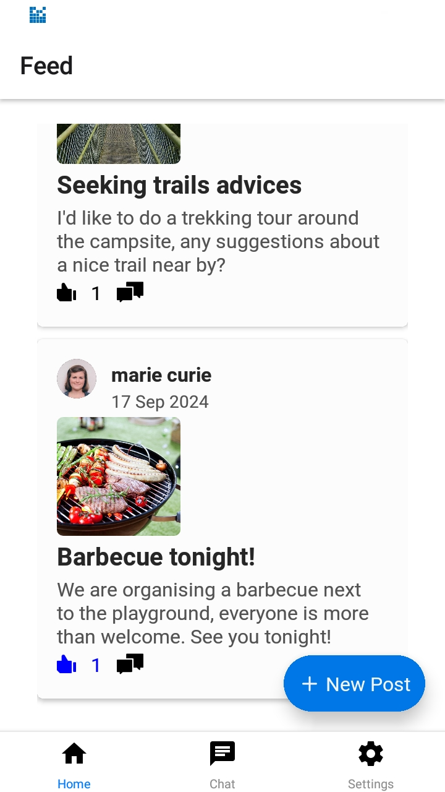
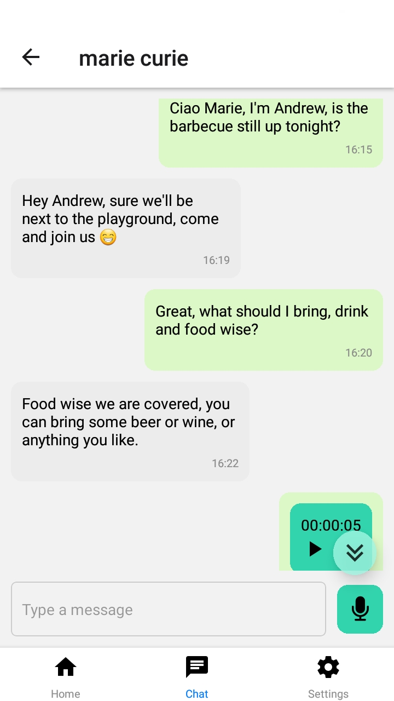

# Welcome to Campy !


This is a proof-of-concept project.
Campy is a social networking platform designed exclusively for the camping community.
It offers a rich array of features aimed at enhancing campers' experiences by facilitating connections, sharing resources, finding help for chores, borrowing items, and organizing outdoor activities.
With Campy, the beauty of camping meets the convenience of modern technology.

It's built with [React Native](https://reactnative.dev/) and [Expo](https://expo.dev/).
Connected to Firebase for authentication and storage.

## Table of Contents

- Installation
- Usage
- Features
- Contributing
- License
- Contact

## Pre-requisites:

- the expo cli
- npm
- git

## Installation

```bash
1. Clone the repository:

- git clone https://github.com/VGiacomo/campy.git

2. Change directory:

- cd campy

3. Install dependencies:

- npm install

4. Start the app:

- npx expo start
```

## Usage







## Features

- You can sign up and log in
- You can create a post and share it on the feed page
- You can like and comment on posts
- You can edit your profile
- You can search for users and start private chats
- In the chat, you can send text and audio messages

<!-- ROADMAP -->

## Roadmap

- [x] Add live update in Feed and Chat screens
- [ ] Add Push notifications
- [ ] When editing a post image, delete the old one in the firebase storage
- [ ] Multi-language Support
  - [ ] French
  - [ ] Italian

## Contact

My name is Giacomo and my email is dev4change@gmail.com

Campy CTA website: https://campers-landing-page.vercel.app/
